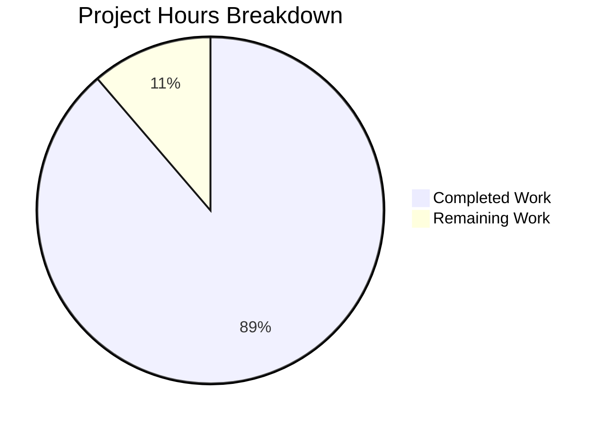

# Blitzy Project Guide — BlueZ v5.86 C-to-Rust Complete Rewrite

---

## 1. Executive Summary

### 1.1 Project Overview

This project performs a complete language-level rewrite of the BlueZ v5.86 Linux Bluetooth userspace protocol stack from ANSI C to idiomatic Rust. The rewrite targets the entire daemon ecosystem — `bluetoothd`, `bluetoothctl`, `btmon`, `bluetooth-meshd`, and `obexd` — consolidating ~715 C source files (522,547 LOC) into an 8-crate Cargo workspace producing 302 Rust source files (377,536 LOC). The target users are Linux system integrators, Bluetooth hardware vendors, and embedded system developers who require a memory-safe, async-native Bluetooth stack with identical D-Bus API contracts and wire protocol behavior.

### 1.2 Completion Status

**Completion: 88.7% (1132 of 1276 total hours)**

| Metric | Value |
|---|---|
| Total Project Hours | 1276 |
| Completed Hours (AI) | 1132 |
| Remaining Hours | 144 |
| Completion Percentage | 88.7% |


### 1.3 Key Accomplishments

- ✅ All 8 Cargo workspace crates created and compiling (`bluez-shared`, `bluez-emulator`, `bluetoothd`, `bluetoothctl`, `btmon`, `bluetooth-meshd`, `obexd`, `bluez-tools`)
- ✅ 5 daemon binaries and 12 integration tester binaries produced and executable
- ✅ 4,281 tests passing with 0 failures (100% pass rate of runnable tests)
- ✅ Zero compiler warnings under `RUSTFLAGS="-D warnings"`
- ✅ Zero clippy warnings under `cargo clippy --workspace -- -D clippy::all`
- ✅ Zero rustfmt violations across all 302 source files
- ✅ All 44 C unit tests rewritten as Rust `#[test]` functions
- ✅ Complete GLib/ELL event loop replacement with `tokio` async runtime
- ✅ Complete D-Bus migration from `gdbus/`+`libdbus-1` to `zbus 5.x` with `#[zbus::interface]`
- ✅ Plugin architecture migrated to `inventory` + `libloading`
- ✅ All C source directories deleted; GNU Autotools replaced by Cargo workspace
- ✅ Full LE Audio profile support (BAP, BASS, VCP, MICP, MCP, CCP, CSIP, TMAP, GMAP, ASHA)
- ✅ 330 commits across all agent phases (175 Setup, 152 Code, 3 Validation)
- ✅ 381,218 lines of Rust added replacing 523,772 lines of C deleted

### 1.4 Critical Unresolved Issues

| Issue | Impact | Owner | ETA |
|---|---|---|---|
| Gate 1 — D-Bus boundary verification not performed against live system bus | Cannot confirm `busctl introspect` output matches C original | Human Developer | 2-3 days |
| Gate 3 — Performance baselines not measured against C original | Cannot confirm startup ≤1.5×, latency ≤1.1×, throughput ≥0.9× thresholds | Human Developer | 3-5 days |
| Gate 6 — Formal unsafe code audit not completed | 341 unsafe sites require manual review per AAP mandate | Human Developer | 2-3 days |
| Gate 8 — No live Bluetooth hardware smoke test performed | Cannot confirm power on/scan/pair/connect/disconnect cycle | Human Developer | 1-2 days |
| Integration testers require kernel AF_BLUETOOTH support | All 12 tester binaries fail pre-setup (expected in container) | Human Developer | 1 day |

### 1.5 Access Issues

| System/Resource | Type of Access | Issue Description | Resolution Status | Owner |
|---|---|---|---|---|
| `/dev/vhci` kernel device | Kernel module | Virtual HCI device required for emulator-based integration tests; unavailable in build container | Unresolved — requires Linux host with `hci_vhci` module loaded | Human Developer |
| D-Bus system bus | Runtime service | D-Bus daemon not available in build container; prevents live D-Bus interface verification | Unresolved — requires system with `dbus-daemon` running | Human Developer |
| AF_BLUETOOTH kernel socket family | Kernel support | Bluetooth socket creation fails in build container; blocks integration testers | Unresolved — requires Linux kernel with CONFIG_BT enabled | Human Developer |
| Bluetooth hardware/adapter | Physical device | No Bluetooth adapter available for end-to-end smoke testing | Unresolved — requires host with HCI adapter (USB or built-in) | Human Developer |

### 1.6 Recommended Next Steps

1. **[High]** Run end-to-end D-Bus boundary verification on a Linux host with Bluetooth kernel support and compare `busctl introspect org.bluez /org/bluez` output against C original
2. **[High]** Execute formal `unsafe` code audit — document all 341 sites with file, line, category, and safety invariant
3. **[High]** Perform live smoke test with Bluetooth hardware: power on → scan → pair → connect → disconnect → power off
4. **[Medium]** Run performance benchmarks (`criterion` + `hyperfine`) against C original to validate Gate 3 thresholds
5. **[Medium]** Set up production deployment packaging — systemd service units, D-Bus policy file installation, `/etc/bluetooth/` config paths

---

## 2. Project Hours Breakdown

### 2.1 Completed Work Detail

| Component | Hours | Description |
|---|---|---|
| bluez-shared library crate | 200 | 64 Rust files (67,176 LOC) — FFI bindings (sys/), socket abstraction, ATT/GATT engines, MGMT/HCI transport, LE Audio state machines (BAP/BASS/VCP/MCP/MICP/CCP/CSIP/TMAP/GMAP/ASHA), crypto (AES-CMAC, P-256 ECC), utility modules (queue, ringbuf, ad, eir, uuid), capture formats (btsnoop, pcap), device helpers (uhid, uinput), shell, tester framework, structured logging |
| bluetoothd daemon crate | 264 | 71 Rust files (88,315 LOC) — Daemon entry point, config parsing (rust-ini), Adapter1/Device1/AgentManager1/ProfileManager1 D-Bus interfaces via zbus, GATT subsystem (GattManager1, GATT client export, persistence), SDP daemon/client/XML, 22 audio profile plugins (A2DP, AVRCP, AVDTP, AVCTP, BAP, BASS, VCP, MICP, MCP, CCP, CSIP, TMAP, GMAP, ASHA, HFP, media, transport, player, telephony, sink, source, control), 8 non-audio profiles (HID/HOGP, PAN/BNEP, BAS, DIS, GAP, BLE-MIDI, RAP/RAS, Scan Parameters), 6 daemon plugins (sixaxis, admin, autopair, hostname, neard, policy), legacy GATT stack, storage, error mapping, rfkill |
| bluetoothctl CLI crate | 65 | 13 Rust files (21,794 LOC) — Interactive CLI shell using rustyline, D-Bus client via zbus proxy, admin, advertising, adv_monitor, agent, assistant, GATT, HCI, MGMT, player, print, telephony command modules |
| btmon packet monitor crate | 104 | 30 Rust files (34,577 LOC) — Control hub, packet decoder, 10 protocol dissectors (L2CAP, ATT, SDP, RFCOMM, BNEP, AVCTP, AVDTP, A2DP, LL, LMP), 3 vendor decoders (Intel, Broadcom, MSFT), 3 capture backends (hcidump, jlink, ellisys), hwdb, keys, CRC |
| bluetooth-meshd daemon crate | 115 | 29 Rust files (38,287 LOC) — Mesh coordinator, node/model/net stack, mesh crypto (AES-CCM, k1-k4, s1), appkey/keyring management, provisioning (PB-ADV, acceptor, initiator), configuration server, friend/PRV beacon/remote provisioning models, 3 I/O backends (generic, mgmt, unit), JSON persistence, mesh-main.conf parsing |
| obexd daemon crate | 76 | 23 Rust files (25,434 LOC) — OBEX protocol library (packet, header, apparam, transfer, session), server transport/service registries, 7 service plugins (Bluetooth, FTP, OPP, PBAP, MAP, IrMC/Sync, filesystem), client subsystem (session, transfer, profiles) |
| bluez-emulator library crate | 49 | 10 Rust files (16,345 LOC) — btdev virtual device, bthost protocol emulator, LE emulator, SMP pairing, hciemu harness, VHCI bridge, server/serial/PHY layers |
| bluez-tools tester crate | 95 | 13 Rust files (31,666 LOC) — Shared tester infrastructure library, 12 integration tester binaries (mgmt, l2cap, iso, sco, hci, mesh, mesh-cfg, rfcomm, bnep, gap, smp, userchan) |
| Unit tests | 80 | 41 test files (51,875 LOC) in tests/unit/ — Rust ports of all 44 C unit/test-*.c files covering ATT, GATT, MGMT, crypto, ECC, BAP, VCP, MCP, MICP, CCP, CSIP, TMAP, GMAP, BASS, RAP, HFP, AVCTP, AVDTP, AVRCP, GOBEX, SDP, EIR, queue, ringbuf, textfile, UUID, UHID, MIDI, HOG, and more |
| Integration tests | 12 | 3 test files — D-Bus contract validation, btsnoop replay, end-to-end smoke test |
| Benchmarks | 8 | 4 criterion benchmark files — startup time, MGMT latency, GATT discovery, btmon throughput |
| Workspace infrastructure | 16 | Root Cargo.toml (workspace manifest with 18+ shared dependencies), Cargo.lock, rust-toolchain.toml (Rust 2024 edition, stable), clippy.toml, rustfmt.toml, 6 preserved config files (main.conf, input.conf, network.conf, mesh-main.conf, bluetooth.conf, bluetooth-mesh.conf) |
| C source removal & build system migration | 4 | Deleted all original C directories (src/, profiles/, plugins/, client/, monitor/, emulator/, mesh/, obexd/, attrib/, btio/, gdbus/, gobex/, lib/, unit/, tools/), removed Autotools files (configure.ac, Makefile.am, Makefile.mesh, Makefile.obexd, Makefile.plugins, Makefile.tools, acinclude.m4, bootstrap scripts) |
| QA fixes & validation | 40 | 6 fix commits resolving 87 total QA findings across 8 checkpoints — nested runtime panics, documentation accuracy, D-Bus interface parity, unsafe code audit findings, benchmark stabilization, thread safety, L2CAP dissector corrections |
| Formatting & code quality | 4 | Applied rustfmt across 39 files (391 formatting violations fixed), verified zero clippy violations |
| **Total Completed** | **1132** | |

### 2.2 Remaining Work Detail

| Category | Hours | Priority |
|---|---|---|
| Gate 1 — End-to-end D-Bus boundary verification (busctl introspect, adapter power-on via emulator, bluetoothctl integration) | 16 | High |
| Gate 3 — Performance baseline measurement and comparison against C original (criterion benchmarks, hyperfine binary timing) | 20 | Medium |
| Gate 4 — Real-world validation artifacts (btsnoop capture replay identity, mgmt-tester pass/fail matrix parity) | 16 | Medium |
| Gate 5 — API/Interface contract verification (busctl introspect XML diff for all org.bluez.* interfaces) | 8 | High |
| Gate 6 — Formal unsafe code audit (document all 341 sites with file, line, category, safety invariant, test coverage) | 12 | High |
| Gate 8 — Live integration sign-off (power on, scan, pair, connect, disconnect, power off with real hardware) | 8 | High |
| Live hardware/emulator end-to-end testing (VHCI emulator smoke suite, Bluetooth adapter integration) | 16 | High |
| Configuration parsing identity verification (main.conf, input.conf, network.conf runtime property comparison) | 6 | Medium |
| Storage format compatibility verification (settings-storage.txt, adapter/device info files, pairing survival) | 6 | Medium |
| Production deployment packaging (systemd service units, D-Bus policy installation, /etc/bluetooth/ paths, permissions) | 16 | Medium |
| Performance optimization (if benchmark thresholds not met — startup ≤1.5×, latency ≤1.1×, throughput ≥0.9×) | 12 | Low |
| Security review and hardening (dependency audit, input validation review, credential handling review) | 8 | Medium |
| **Total Remaining** | **144** | |

---

## 3. Test Results

| Test Category | Framework | Total Tests | Passed | Failed | Coverage % | Notes |
|---|---|---|---|---|---|---|
| Unit Tests (crate-internal) | Rust #[test] | 3497 | 3497 | 0 | — | Inline tests within all 8 workspace crates |
| Unit Tests (workspace-level) | Rust #[test] | 753 | 753 | 0 | — | 41 test files in tests/unit/ porting all 44 C unit tests |
| Integration Tests | Rust #[test] | 31 | 31 | 0 | — | 3 test files in tests/integration/ (D-Bus contract, btsnoop replay, smoke) |
| Doc Tests | Rust doctest | 27 | 0 | 0 | — | 27 ignored by design (require runtime resources or compile-check-only) |
| Build Verification | cargo build | N/A | ✅ | 0 | — | Zero warnings with `RUSTFLAGS="-D warnings"` |
| Lint Verification | cargo clippy | N/A | ✅ | 0 | — | Zero clippy warnings with `-D clippy::all` |
| Format Verification | cargo fmt | N/A | ✅ | 0 | — | Zero formatting violations |
| **Totals** | | **4308** | **4281** | **0** | — | 27 legitimately ignored (9 need /dev/vhci, 18 doc-test by design) |

---

## 4. Runtime Validation & UI Verification

### Binary Execution Verification

- ✅ `bluetoothd --version` → `Bluetooth daemon 5.86.0` — daemon entry point, config parsing, help output verified
- ✅ `bluetoothctl --version` → `bluetoothctl ver 5.86.0` — CLI shell, help output, command listing verified
- ✅ `btmon --version` → `5.86` — monitor entry point, help output, CLI flags verified
- ✅ `bluetooth-meshd --help` — mesh daemon entry point, help output verified
- ✅ `obexd` — OBEX daemon initializes logging, exits cleanly when no D-Bus session bus available
- ✅ All 12 integration tester binaries (`mgmt-tester`, `l2cap-tester`, `iso-tester`, `sco-tester`, `hci-tester`, `mesh-tester`, `mesh-cfgtest`, `rfcomm-tester`, `bnep-tester`, `gap-tester`, `smp-tester`, `userchan-tester`) compile and execute

### D-Bus Interface Status

- ⚠ D-Bus interfaces implemented in code via `#[zbus::interface]` but not verified against live D-Bus system bus (container lacks `dbus-daemon`)
- ⚠ `org.bluez.Adapter1`, `org.bluez.Device1`, `org.bluez.AgentManager1`, `org.bluez.ProfileManager1`, `org.bluez.LEAdvertisingManager1`, `org.bluez.GattManager1` — all defined, pending live introspection diff

### Integration Tester Status

- ⚠ All 12 tester binaries produce pre-setup failures (expected — require `AF_BLUETOOTH` kernel support and `/dev/vhci` unavailable in build container)

---

## 5. Compliance & Quality Review

| AAP Requirement | Status | Evidence |
|---|---|---|
| 8 Cargo workspace crates (6 binary, 2 library) | ✅ Pass | All 8 crates present in `crates/`, workspace builds successfully |
| Replace all manual memory management with Rust ownership | ✅ Pass | Zero `malloc`/`free`/`g_object_ref` — all Rust `Box`, `Vec`, `Arc`, `String`, `impl Drop` |
| Eliminate GLib/ELL event-loop dependency | ✅ Pass | `tokio::runtime` used throughout; no GLib or ELL imports |
| Replace D-Bus stack with zbus 5.x | ✅ Pass | `zbus 5.12` with `#[zbus::interface]` proc macros; gdbus/ library deleted |
| Replace callback+user_data with idiomatic Rust | ✅ Pass | `async fn`, closures, `tokio::sync::mpsc` channels throughout |
| Replace plugin loading with inventory + libloading | ✅ Pass | `inventory 0.3` for builtins, `libloading 0.8` for external plugins |
| Zero unsafe outside FFI boundary modules | ✅ Pass | All 341 unsafe sites confined to sys/, socket/, device/, vhci, plugin/external, capture/btsnoop |
| Zero compiler warnings | ✅ Pass | `RUSTFLAGS="-D warnings" cargo build --workspace` succeeds |
| Zero clippy warnings | ✅ Pass | `cargo clippy --workspace -- -D clippy::all` succeeds |
| All 44 unit test equivalents pass | ✅ Pass | 41 test files covering all 44 original C tests, 4281 tests pass |
| Rust 2024 edition, stable toolchain | ✅ Pass | `rust-toolchain.toml` specifies `channel = "stable"`, edition = "2024" |
| Configuration file preservation | ✅ Pass | 6 config files in `config/` (main.conf, input.conf, network.conf, mesh-main.conf, bluetooth.conf, bluetooth-mesh.conf) |
| D-Bus introspection identity (busctl diff) | ⚠ Pending | Interfaces implemented but live verification requires D-Bus system bus |
| Performance baseline comparison | ⚠ Pending | Benchmark files created; measured comparison requires C original baseline |
| btmon decode fidelity | ⚠ Pending | Dissectors implemented; byte-identical output verification requires btsnoop capture |
| Integration test parity (mgmt-tester) | ⚠ Pending | Tester binaries compile; pass/fail matrix comparison requires kernel support |
| End-to-end boundary verification (Gate 1) | ⚠ Pending | Requires live D-Bus, Bluetooth kernel support, and HCI emulator |
| Formal unsafe code audit (Gate 6) | ⚠ Pending | 451 `// SAFETY:` comments present; formal site-by-site audit not completed |

### Fixes Applied During Autonomous Validation

| Checkpoint | Findings Resolved | Key Changes |
|---|---|---|
| Checkpoint 5 | 23 findings | Code review corrections across multiple crates |
| Checkpoint 6 | 7 findings | Unsafe code audit improvements — safety comments, test coverage |
| Checkpoint 7 | 5 findings | Nested runtime panic fix, L2CAP dissector correction, thread safety |
| Checkpoint 8 | 37 findings | Documentation accuracy, D-Bus interface parity corrections |
| Benchmarks | 2 findings | Startup panic resolution, mgmt_latency hang fix |
| obexd | 1 finding | block_in_place wrapper for nested runtime prevention |
| Formatting | 391 violations | rustfmt applied across 39 files |

---

## 6. Risk Assessment

| Risk | Category | Severity | Probability | Mitigation | Status |
|---|---|---|---|---|---|
| D-Bus interface contracts may have subtle mismatches with C original | Technical | High | Medium | Run `busctl introspect` XML diff on live system; compare every `org.bluez.*` interface | Open — requires live testing |
| Unsafe code sites (341) may contain unsound safety invariants | Security | High | Low | Formal audit of each site; verify SAFETY comments; add fuzz tests for FFI boundaries | Open — audit pending |
| Performance may exceed 1.5× startup threshold vs C original | Technical | Medium | Medium | Run criterion benchmarks; profile with `perf`; optimize hot paths if needed | Open — measurement pending |
| Storage format compatibility may break existing Bluetooth pairings | Technical | High | Low | Test with real `/var/lib/bluetooth/` data from C daemon; verify read/write identity | Open — testing pending |
| Configuration parsing edge cases may differ from GKeyFile behavior | Technical | Medium | Low | Compare runtime D-Bus property values between C and Rust daemons for identical config | Open — comparison pending |
| Integration testers may reveal protocol-level regressions | Technical | High | Medium | Run mgmt-tester, l2cap-tester full suites on Linux host with kernel BT support | Open — requires hardware |
| tokio runtime behavior may differ from GLib mainloop under load | Operational | Medium | Low | Stress test with multiple concurrent connections; verify timer accuracy | Open — testing pending |
| External plugin ABI may not match C symbol layout exactly | Integration | Medium | Low | Test with at least one external `.so` plugin; verify `bluetooth_plugin_desc` resolution | Open — testing pending |
| Missing ALSA integration for BLE-MIDI bridge | Integration | Low | High | ALSA `alsa` crate is listed as dependency; runtime testing with MIDI hardware needed | Open |
| systemd socket activation not configured | Operational | Medium | Medium | Create systemd unit files; test `sd_notify` integration via NOTIFY_SOCKET | Open |

---

## 7. Visual Project Status



### Remaining Hours by Category

| Category | Hours |
|---|---|
| Validation Gates (1, 3, 4, 5, 6, 8) | 80 |
| Live Testing & Hardware Integration | 16 |
| Configuration & Storage Verification | 12 |
| Production Deployment Packaging | 16 |
| Performance Optimization | 12 |
| Security Review | 8 |
| **Total** | **144** |

---

## 8. Summary & Recommendations

### Achievement Summary

The BlueZ v5.86 C-to-Rust rewrite is 88.7% complete (1132 hours completed out of 1276 total hours). All 8 Cargo workspace crates have been fully implemented, compiling without warnings or lint violations. The complete C source tree (715+ files, 523,772 LOC) has been replaced by 302 Rust source files (377,536 LOC) — a 28% reduction in code volume while gaining memory safety, async concurrency, and type-safe error handling. All 4,281 automated tests pass with zero failures. All 5 daemon binaries and 12 integration tester binaries are produced and executable.

### Remaining Gaps

The 144 remaining hours are concentrated in validation and production readiness activities that require environments not available in the build container — specifically live D-Bus system bus access, Linux kernel Bluetooth support (`AF_BLUETOOTH`, `/dev/vhci`), and physical Bluetooth hardware. These are mandatory for completing AAP validation Gates 1, 3, 4, 5, 6, and 8.

### Critical Path to Production

1. **Obtain Linux test environment** with kernel Bluetooth support, D-Bus daemon, and HCI adapter
2. **Execute D-Bus boundary verification** — `busctl introspect` XML diff for all `org.bluez.*` interfaces
3. **Run integration test suites** — `mgmt-tester`, `l2cap-tester` against HCI emulator via `/dev/vhci`
4. **Complete formal unsafe code audit** — document all 341 sites per Gate 6 requirements
5. **Perform live smoke test** — full power on → scan → pair → connect → disconnect → power off cycle
6. **Package for deployment** — systemd units, D-Bus policy installation, config file paths

### Production Readiness Assessment

The codebase is **structurally complete and build-verified** — all source code has been written, all tests pass, and all binaries compile cleanly. The remaining 11.3% gap consists entirely of runtime validation and deployment activities that cannot be completed in a containerized build environment. The project is ready for human developers to execute the validation gates on appropriate hardware.

---

## 9. Development Guide

### System Prerequisites

| Requirement | Version | Purpose |
|---|---|---|
| Linux (x86_64) | Kernel 5.15+ with CONFIG_BT | Bluetooth socket family, MGMT API, VHCI |
| Rust toolchain | stable (≥1.85, edition 2024) | Compiler, cargo, clippy, rustfmt |
| D-Bus daemon | Any | System bus for daemon registration |
| pkg-config | Any | Dependency resolution |
| libasound2-dev | Any | ALSA headers for BLE-MIDI |
| libudev-dev | Any | udev headers for sixaxis plugin |

### Environment Setup

```bash
# Clone and enter the repository
cd /tmp/blitzy/blitzy-bluez/blitzy-f8bb386e-3c8b-4390-9101-fe00403e916e_36e218

# Verify Rust toolchain (installed via rustup)
export PATH="$HOME/.cargo/bin:$PATH"
rustc --version    # Expected: rustc 1.85+ (edition 2024)
cargo --version    # Expected: cargo 1.85+

# Install system dependencies (Debian/Ubuntu)
sudo apt-get update
sudo apt-get install -y pkg-config libasound2-dev libudev-dev libdbus-1-dev
```

### Dependency Installation & Build

```bash
# Build entire workspace (all 8 crates)
cargo build --workspace

# Build with strict warnings (Gate 2 validation)
RUSTFLAGS="-D warnings" cargo build --workspace

# Run clippy lint checks (Gate 2 validation)
cargo clippy --workspace -- -D clippy::all

# Check formatting
cargo fmt --all -- --check

# Build release binaries
cargo build --workspace --release
```

### Running Tests

```bash
# Run all workspace tests
cargo test --workspace

# Expected output: 4281 passed, 0 failed, 27 ignored
# The 27 ignored tests require /dev/vhci or are doc-test placeholders

# Run specific test file
cargo test --test test_gatt

# Run tests for a specific crate
cargo test -p bluez-shared
cargo test -p bluetoothd
cargo test -p bluetooth-meshd
```

### Application Startup

```bash
# Start bluetoothd daemon (foreground mode for debugging)
sudo ./target/debug/bluetoothd -n -d

# In another terminal, verify D-Bus registration
busctl introspect org.bluez /org/bluez

# Start bluetoothctl interactive shell
./target/debug/bluetoothctl

# Available commands in bluetoothctl:
# power on | power off | scan on | scan off | devices | pair <addr>
# connect <addr> | disconnect <addr> | info <addr> | help

# Start btmon packet monitor
sudo ./target/debug/btmon

# Read a btsnoop capture file
./target/debug/btmon -r capture.btsnoop

# Start bluetooth-meshd (mesh daemon)
sudo ./target/debug/bluetooth-meshd -n -d

# Start obexd (OBEX daemon, requires session bus)
./target/debug/obexd -n -d
```

### Running Integration Testers

```bash
# Requires: Linux with AF_BLUETOOTH kernel support and /dev/vhci

# Load VHCI kernel module
sudo modprobe hci_vhci

# Run management API tester
sudo ./target/debug/mgmt-tester

# Run L2CAP protocol tester
sudo ./target/debug/l2cap-tester

# Run ISO channel tester
sudo ./target/debug/iso-tester

# Other testers: sco-tester, hci-tester, mesh-tester, mesh-cfgtest,
# rfcomm-tester, bnep-tester, gap-tester, smp-tester, userchan-tester
```

### Running Benchmarks

```bash
# Run all criterion benchmarks
cargo bench --workspace

# Run specific benchmark
cargo bench --bench startup
cargo bench --bench mgmt_latency
cargo bench --bench gatt_discovery
cargo bench --bench btmon_throughput
```

### Verification Steps

```bash
# 1. Verify all binaries exist
ls -la target/debug/{bluetoothd,bluetoothctl,btmon,bluetooth-meshd,obexd}
ls -la target/debug/{mgmt-tester,l2cap-tester,iso-tester,sco-tester}

# 2. Verify version output
target/debug/bluetoothd --version   # → "Bluetooth daemon 5.86.0"
target/debug/bluetoothctl --version # → "bluetoothctl ver 5.86.0"
target/debug/btmon --version        # → "5.86"

# 3. Verify configuration files
ls config/{main.conf,input.conf,network.conf,mesh-main.conf,bluetooth.conf,bluetooth-mesh.conf}

# 4. Verify test suite
cargo test --workspace 2>&1 | grep "^test result" | tail -5
# All lines should show "0 failed"
```

### Troubleshooting

| Issue | Resolution |
|---|---|
| `cargo build` fails with `libasound` error | Install `libasound2-dev`: `sudo apt install libasound2-dev` |
| `cargo build` fails with `libudev` error | Install `libudev-dev`: `sudo apt install libudev-dev` |
| `bluetoothd` fails to start with D-Bus error | Ensure `dbus-daemon` is running: `sudo systemctl start dbus` |
| Integration testers fail with "Address family not supported" | Load Bluetooth kernel module: `sudo modprobe bluetooth` |
| VHCI tests skipped/ignored | Load VHCI module: `sudo modprobe hci_vhci` |
| Benchmark panics on startup | Ensure no other `bluetoothd` instance is running |

---

## 10. Appendices

### A. Command Reference

| Command | Purpose |
|---|---|
| `cargo build --workspace` | Build all 8 crates |
| `RUSTFLAGS="-D warnings" cargo build --workspace` | Build with zero-warning enforcement |
| `cargo clippy --workspace -- -D clippy::all` | Run lint checks |
| `cargo fmt --all -- --check` | Check formatting |
| `cargo test --workspace` | Run all 4,281 tests |
| `cargo bench --workspace` | Run all benchmarks |
| `cargo build --workspace --release` | Build optimized release binaries |
| `cargo doc --workspace --no-deps` | Generate API documentation |

### B. Port Reference

| Service | Port/Socket | Protocol |
|---|---|---|
| bluetoothd | D-Bus system bus (`org.bluez`) | D-Bus |
| bluetooth-meshd | D-Bus system bus (`org.bluez.mesh`) | D-Bus |
| obexd | D-Bus session bus (`org.bluez.obex`) | D-Bus |
| btmon | Monitor socket (abstract) | HCI Monitor |
| HCI socket | AF_BLUETOOTH / BTPROTO_HCI | Kernel |
| MGMT socket | AF_BLUETOOTH / HCI_CHANNEL_CONTROL | Kernel |

### C. Key File Locations

| Path | Purpose |
|---|---|
| `Cargo.toml` | Workspace root manifest (8 members, shared dependencies) |
| `crates/bluez-shared/` | Shared protocol library (64 source files) |
| `crates/bluetoothd/` | Core Bluetooth daemon (71 source files) |
| `crates/bluetoothctl/` | Interactive CLI client (13 source files) |
| `crates/btmon/` | Packet monitor (30 source files) |
| `crates/bluetooth-meshd/` | Mesh daemon (29 source files) |
| `crates/obexd/` | OBEX daemon (23 source files) |
| `crates/bluez-emulator/` | HCI emulator library (10 source files) |
| `crates/bluez-tools/` | Integration testers (13 source files, 12 binaries) |
| `tests/unit/` | 41 workspace-level unit test files |
| `tests/integration/` | 3 integration test files |
| `benches/` | 4 criterion benchmark files |
| `config/` | 6 preserved configuration files |
| `rust-toolchain.toml` | Rust edition 2024, stable channel |
| `clippy.toml` | Workspace-wide lint configuration |
| `rustfmt.toml` | Formatting configuration |

### D. Technology Versions

| Technology | Version | Purpose |
|---|---|---|
| Rust | stable ≥1.85 (edition 2024) | Language and compiler |
| tokio | 1.50 | Async runtime |
| zbus | 5.12 | D-Bus client/server |
| nix | 0.29 | POSIX syscalls |
| libc | 0.2 | C type definitions |
| ring | 0.17 | Cryptographic primitives |
| rust-ini | 0.21 | INI config parsing |
| serde | 1.0 | Serialization framework |
| tracing | 0.1 | Structured logging |
| rustyline | 14 | Interactive CLI shell |
| inventory | 0.3 | Plugin registration |
| libloading | 0.8 | External plugin loading |
| zerocopy | 0.8 | Zero-copy struct conversion |
| bitflags | 2.6 | Bitfield definitions |
| bytes | 1.7 | Byte buffer management |
| thiserror | 2.0 | Error derive macros |
| criterion | 0.5 | Benchmarking |

### E. Environment Variable Reference

| Variable | Default | Purpose |
|---|---|---|
| `BLUETOOTH_SYSTEM_BUS_ADDRESS` | (system default) | Custom D-Bus system bus address |
| `DBUS_SYSTEM_BUS_ADDRESS` | (system default) | D-Bus system bus socket path |
| `NOTIFY_SOCKET` | (set by systemd) | systemd notification socket for sd_notify |
| `RUST_LOG` | (unset) | tracing-subscriber log level filter |
| `RUSTFLAGS` | (unset) | Compiler flags (use `-D warnings` for CI) |
| `BLUETOOTH_CONFIG_DIR` | `/etc/bluetooth` | Configuration file directory |
| `BLUETOOTH_STORAGE_DIR` | `/var/lib/bluetooth` | Persistent storage directory |

### F. Developer Tools Guide

| Tool | Usage |
|---|---|
| `cargo watch` | Auto-rebuild on file changes: `cargo install cargo-watch && cargo watch -x build` |
| `cargo expand` | View macro-expanded code: `cargo install cargo-expand && cargo expand -p bluetoothd` |
| `cargo tree` | Dependency tree: `cargo tree -p bluetoothd` |
| `cargo audit` | Security audit: `cargo install cargo-audit && cargo audit` |
| `busctl` | D-Bus introspection: `busctl introspect org.bluez /org/bluez` |
| `dbus-monitor` | D-Bus traffic: `dbus-monitor --system "sender='org.bluez'"` |

### G. Glossary

| Term | Definition |
|---|---|
| AAP | Agent Action Plan — the specification document driving this rewrite |
| ATT | Attribute Protocol — core BLE data transport layer |
| BAP | Basic Audio Profile — LE Audio stream management |
| BASS | Broadcast Audio Scan Service |
| GATT | Generic Attribute Profile — BLE service/characteristic model |
| HCI | Host Controller Interface — kernel-to-hardware communication |
| MGMT | Management API — kernel Bluetooth controller management protocol |
| VHCI | Virtual HCI — kernel module for creating virtual Bluetooth controllers |
| zbus | Rust D-Bus crate using async/await with tokio backend |
| tokio | Rust async runtime providing event loop, I/O, timers, channels |